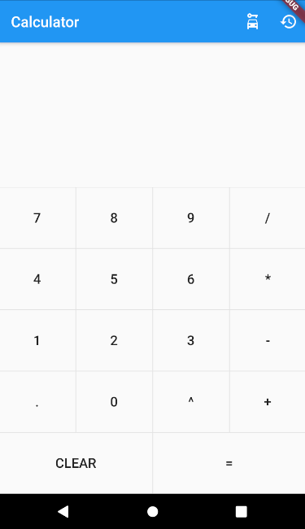
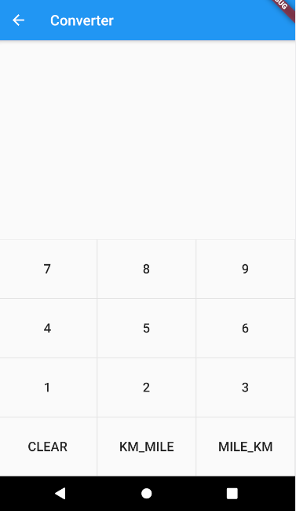
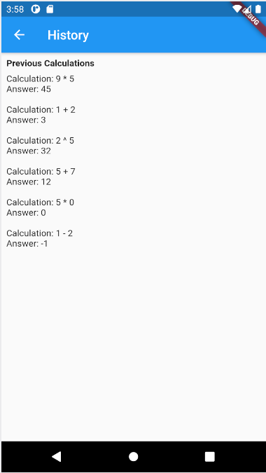

# Calculator
##### A Flutter calculator that uses Firestore and has KM-Mile convertor


## Features

- Does basic arithmetic along with POW(^) calculations
- Convert Km-Miles and vice-versa


## Tech

- Flutter 2.2.1 • channel stable • https://github.com/flutter/flutter.git
- Engine • revision 0fdb562ac8
- Tools • Dart 2.13.1


## Installation

Make sure you have flutter installed.
Clone the repo and then,
```sh
> flutter run
```

## App screens
Calulator screen/ Home Page:



Convertor Page:


History Page:
